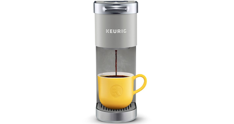
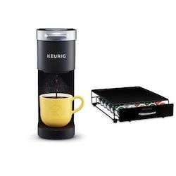

# *Making a cup of coffee*

## Objective:
Make a cup of coffee with a Keurig coffee maker. 

 

## Operation
1. Plug in power cord attached to back of coffee machine.

2. Press small round power button on top of machine.  The power
button will illuminate.

3. Wait for the brew indicator light will flash to indicate that the brewer is ready

4. Lift the water reservoir lid on top back of coffee machine.

5. Pour desired amount of water 6oz, 8oz, 10oz or 12oz into the reservoir.

6. Close water reservoir lid on top back of coffee machine. 

7. Grab coffee mug from left side of coffee machine. 

8. Place coffee mug on the drip tray. Under the spout. 

9. Choose desired K-Cup pod from drawer on right side of Keurig coffee machine. 

10. Lift the K-Cup insert placement handle on coffee machine located on top front.

11. Place a K-Cup pod in
the K-Cup pod holder.

12.  Lower the handle
completely to close the lid.

13. The brew indicator light will flash to indicate that the brewer is ready. 

14. For bolder coffee, press the STRONG button before pressing the brew button.

15. Press the desired brew button fill size 6oz, 8oz, 10oz or 12oz.

16. Wait while the desired coffee brew size begin to dispense.

17. Brewing is complete when the brew indicator light is no longer illuminated.

18. When complete,
lift the handle on top front of coffee machine.

19. Remove the used K-Cup pod from coffee machine.

20. Dispose used K-Cup pod in trash

19. Enjoy your cup of coffee. 

## Instructions:
1.  If power cord is inserted into power socket in wall 
    -Then proceed to step 2  
    If power cord is not inserted into power socket in wall 
    -Then plug power cord into power socket in desired wall 

2.  If power is off 
    Then press small round power button on top of machine. The power button will illuminate. 
    If power is on 
    Then proceed to step 3 

3.  If brew indicator light is flashing
    Then proceed to step 4
    If brew indicator light is not flashing
    Then wait for brew light to start flashing

4.  If water reservoir lid on top back of coffee machine is closed
    Then open water reservoir lid on top back of coffee machine
    If Water reservoir lid is open on top back 
    Then proceed to step 5

5.  If no water in water reservoir 
    Then pour desired amount 6oz, 8oz, 10oz or 12oz
    If water is in the water reservoir 
    Then proceed to step 6    

6.  If water reservoir is open on top back of machine
    Then close water reservoir lid
    If water reservoir is closed then repeat back to step 4

7.  If no coffee mug on drip tray under spout
    Then grab a mug from left side of coffee machine
    If coffee mug is on drip tray under spout 
    Then proceed to step 8

8.  If coffee mug grabbed
    Then place on drip tray under spout
    If no coffee mug grabbed 
    Then go back to step 7

9.  If no K-Cup 
    Then choose desired flavor located on right side of coffee machine

10. If K-cup placement handle is closed
    Then lift hangle on front top of coffee manchine 

11. If no unused K-Cup in K-Cup holder
    Then place desired K-Cup pod in K-Cup holder. 

12. If K-Cup holder lid is open
    Then close the lid

13. If brew indicator light is flashing 
    Then ready to brew. 
    If brew light indicator is not flashing then wait until flashing beginss

14. If bolder coffee is preferred 
    Then press STRONG button 
    If no bolder coffee is preferred continue to 15

15. If 6oz is preferred
    Then press 6oz 
    If 8oz is preferred 
    Then press 8oz
    If 10oz is preferred
    Then press 10oz
    If 12oz is preferred
    Then press 12oz

16. If coffee is being dispensed 
    Then wait until completed 
    If coffee isnt being dispensed 
    Then repeat step 15

17. If the brew indicator light is not loger illuminated 
    Then coffee is brewed
    If the brew indicator light is on 
    Then wait until light turns off

18.  

          

