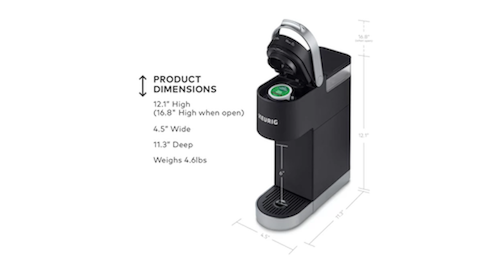

# *Making a cup of coffee*

## Objective:
Make a cup of coffee with a Keurig coffee maker. 

 

## Operation
1. Plug in power cord attached to back of coffee machine.

2. Press small round power button on top of machine.  The power
button will illuminate.

3. Wait for the brew indicator light will flash to indicate that the brewer is ready

4. Lift the water reservoir lid.

5. Pour desired amount of water 6oz, 8oz, 10oz or 12oz into the reservoir.

6. Close water reservoir lid. 

7. Grab coffee mug from left side of coffee machine. 

8. Place coffee mug on the drip tray. Under the spout. 

9. Choose desired K-Cup pod from drawer on right side of Keurig coffee machine. 

10. Lift the handle.

11. Place a K-Cup pod in
the K-Cup® pod holder.

12.  Lower the handle
completely to close the lid.

13. The brew indicator light will flash to indicate that the brewer is ready. Do not remove the foil lid on the K-Cup pod.

14. For bolder coffee, press the STRONG button before pressing the brew button.

15. Press the desired brew button fill size 6oz, 8oz, 10oz or 12oz.

16. Wait while the desired coffee brew size begin to dispense.

17. Brewing is complete when the brew indicator light is no longer illuminated.

18. When complete,
lift the handle and dispose of the used K-Cup pod.

19. Enjoy your cup of coffee. 

## Instructions:
1.  If power cord is inserted into power socket in wall 
        Then proceed to step 2 
    If power cord is not inserted into power socket in wall
        Then plug power cord into power socket in desired wall

2.  If power is off
        Then press small round power button on top of machine. The power button will illuminate.
    If power is on
        Then proceed to step 3

3.  If brew indicator light is flashing
        Then proceed to step 4
    If brew indicator light is not flashing
        Then wait for brew light to start flashing

4.  If water reservoir lid is closed
        Then open water reservoir lid
    If Water reservoir lid is open 
        Then proceed to step 5

5.  If no water in water reservoir 
        Then pour desired amount 6oz, 8oz, 10oz or 12oz
    If water is in the water reservoir 
        Then proceed to step 6    

6.  If water reservoir is open
        Then close water reservoir lid
    If water reservoir is closed then repeat back to step 4

7.  If no coffee mug on drip tray under   spout
        Then grab a mug from left side of coffee machine
    If coffee mug is on drip tray under spout 
        Then proceed to step 8

8.  If coffee mug grabbed
        Then place on drip tray under spout
    If no coffee mug grabbed 
        Then go back to step 7

9.                           
          

